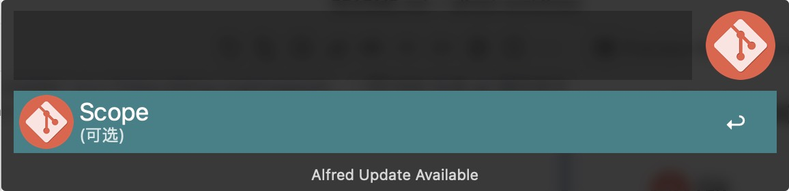

# alfred-workflows

##  Git

### 生成 git 提交命令





👇

```
git commit -m 'feat: new feature'
```

##  Jekyll

### 生成 post 文件名


👇

```
2022-6-15-happy.md
```

##  Search

### 关键词搜索(必应)


### Github 搜索


